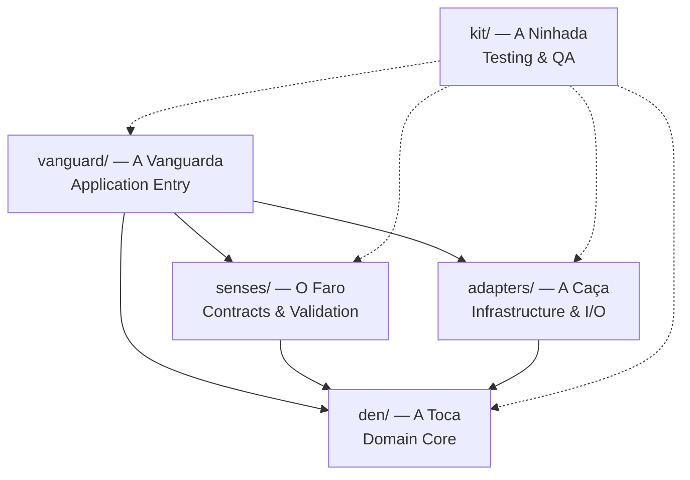

# Den Architecture

A **Den Architecture** é o padrão arquitetural do Vulpes Code Standard. Ela
organiza o software em **cinco camadas estritas**, com responsabilidades
explícitas e um fluxo de dependência **unidirecional: de fora para dentro**.

O nome vem do vocabulário Vulpes: cada camada é uma parte do comportamento de
uma raposa (a toca, o faro, a caça, a vanguarda e a ninhada).

## As cinco camadas

| Diretório | Conceito Vulpes | Camada tradicional | Responsabilidade técnica |
| --------- | --------------- | ------------------ | ------------------------ |
| `den/` | **A Toca** | Domain Core | Regras de negócio puras, estruturas de dados centrais e algoritmos. Zero dependências externas. |
| `senses/` | **O Faro** | Contracts & Validation | Sanitização, validação de limites de buffer, schemas, autorização, telemetria e logging. |
| `adapters/` | **A Caça** | Infrastructure & I/O | Bases de dados, APIs de terceiros, drivers de hardware, sockets e sistema de ficheiros. |
| `vanguard/` | **A Vanguarda** | Application Entry | Pontos de entrada, CLI, handlers de API, inicialização, ciclo de vida e `main`. |
| `kit/` | **A Ninhada** | Testing & QA | Testes unitários e de integração, mocks, fixtures e testes de carga. |

### Correspondência de vocabulário

A Den Architecture é inspirada em arquitetura em camadas e em arquitetura
hexagonal. O vocabulário Vulpes é um apelido estável para conceitos tradicionais:

| Vocabulário Vulpes | Conceito tradicional |
| ------------------ | -------------------- |
| A Toca (`den/`) | Domain Core / modelo de domínio |
| O Faro (`senses/`) | Fronteira de validação / contratos e entrada |
| A Caça (`adapters/`) | Infraestrutura / portas e adaptadores de I/O |
| A Vanguarda (`vanguard/`) | Application Entry / composição e orquestração |
| A Ninhada (`kit/`) | Testes e garantia de qualidade |

## Fluxo de dependências

O fluxo é **estritamente unidirecional, de fora para dentro**. Uma camada só
pode depender de camadas mais internas, nunca o contrário.



Leitura do diagrama:

- `vanguard/` é a única camada autorizada a orquestrar todas as demais.
- `senses/` e `adapters/` dependem apenas de `den/`.
- `den/` **não depende de ninguém**.
- `kit/` pode importar qualquer camada (é a suíte de testes), mas **nenhuma
  camada de produção pode importar `kit/`**.

## Regras de isolamento

### `den/` — A Toca

O núcleo do domínio deve permanecer completamente isolado de detalhes externos.

**`den/` não pode importar:**

- `senses/`
- `adapters/`
- `vanguard/`

Além disso, `den/` **não deve possuir dependências externas desnecessárias**.
Regras de negócio e algoritmos devem ser expressos sem bibliotecas de I/O,
frameworks ou acesso a rede/ficheiros.

### `senses/` — O Faro

Fronteira de confiança da aplicação. Nada vindo do exterior alcança `den/` sem
passar por aqui. Responsabilidades:

- validação de entrada;
- limites de buffers;
- validação de schemas;
- autorização;
- telemetria e logging;
- normalização de dados.

`senses/` pode depender de `den/`, mas **não** de `adapters/` nem de `vanguard/`.

### `adapters/` — A Caça

**Todo** o código que interage diretamente com sistemas externos reside
exclusivamente em `adapters/`:

- sistema de ficheiros;
- bases de dados;
- APIs externas;
- drivers de hardware;
- sockets;
- serviços externos.

`adapters/` pode depender de `den/`, mas **não** de `vanguard/`.

### `vanguard/` — A Vanguarda

`vanguard/` é a camada de **Application Entry** e a única responsável por
orquestrar a aplicação. É o "ponto de composição" onde as peças se encontram.

Responsabilidades:

- inicialização da aplicação;
- interfaces CLI;
- handlers de API;
- ciclo de vida;
- função `main`;
- orquestração entre `senses/`, `adapters/` e `den/`.

A `vanguard/` deve enviar para `den/` **apenas dados devidamente tratados e
validados** por `senses/`.

### `kit/` — A Ninhada

Contém os mecanismos de qualidade e validação do projeto:

- testes unitários;
- testes de integração;
- mocks;
- fixtures;
- testes de carga.

## Fluxo de dados

O caminho de uma requisição ou evento segue sempre a mesma direção:

```text
entrada externa
      │
      ▼
 vanguard/            (recebe, inicializa, orquestra)
      │
      ▼
  senses/             (valida, sanitiza, autoriza, registra)
      │  dados confiáveis
      ▼
   den/               (aplica regras de negócio puras)
      ▲
      │  quando há necessidade de I/O
 adapters/            (executa o efeito externo)
```

1. A entrada chega por `vanguard/`.
2. `senses/` valida e normaliza. Dados inválidos são rejeitados aqui.
3. Apenas dados confiáveis chegam a `den/`.
4. Quando é necessário ler/escrever algo externo, `den/` define *o que* precisa
   (via contrato) e `adapters/` executa *como*.

## Exemplos

### Exemplo correto — dependências internas

```python
# vanguard/api.py  (Application Entry)
from senses.validation import validate_user_payload
from den.user import User


def create_user(payload: dict[str, str]) -> User:
    data = validate_user_payload(payload)
    return User(id=data["id"], name=data["name"])
```

```python
# senses/validation.py  (Contracts & Validation)
def validate_user_payload(payload: dict[str, str]) -> dict[str, str]:
    ...
```

```python
# den/user.py  (Domain Core — sem imports externos)
from dataclasses import dataclass


@dataclass(frozen=True)
class User:
    id: str
    name: str
```

### Exemplo correto — I/O isolado em `adapters/`

```python
# adapters/user_repository.py  (Infrastructure & I/O)
from den.user import User


class UserRepository:
    def load(self, user_id: str) -> User:
        ...  # acesso a base de dados/ficheiros fica aqui
```

## Anti-patterns

| Anti-pattern | Por que é errado |
| ------------ | ---------------- |
| `den/` importar `requests`, `sqlite3` ou `os` para I/O | Viola o isolamento do domínio; torna o núcleo dependente de infraestrutura |
| `den/` importar `senses/`, `adapters/` ou `vanguard/` | Inverte o fluxo de dependência |
| Colocar validação dentro de `den/` | Validação pertence a `senses/` |
| Acessar base de dados diretamente em `vanguard/` | I/O pertence exclusivamente a `adapters/` |
| Lógica de negócio em `vanguard/` | `vanguard/` orquestra; não decide regras de negócio |
| Camada de produção importar `kit/` | `kit/` é apenas para testes |
| Criar uma sexta camada sem justificativa | Aumenta acoplamento e dilui responsabilidades |

> **Regra de ouro:** se você não consegue explicar em uma frase qual é a
> responsabilidade de uma unidade e do que ela depende, a fronteira ainda não
> está clara.
