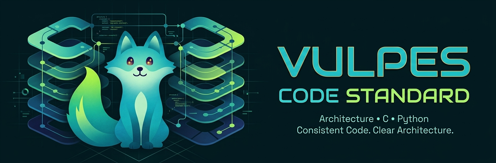

{ .vulpes-hero }

# Vulpes Code Standard

O **Vulpes Code Standard** é o contrato técnico oficial para os projetos da equipe
em **C** e **Python**. Ele reúne, em um único lugar:

- regras de **estilo de código** para C e Python;
- a **Den Architecture**, um padrão de organização em camadas;
- a **política de gerenciamento de memória** baseada em lifetime e arena allocation;
- **arquivos de configuração prontos a usar** para as ferramentas do ecossistema;
- **documentação técnica centralizada** e publicada automaticamente.

## Por que este padrão existe

Bases de código em C e Python tendem a divergir em formatação, nomenclatura e
organização. Essa divergência aumenta o custo de revisão, dificulta a integração
de novos membros e esconde problemas de acoplamento. O Vulpes Code Standard
resolve isso fixando convenções únicas e verificáveis.

## Objetivos

1. **Padronização estilística** — configurações prontas (`.editorconfig`,
   `.clang-format`, `pyproject.toml`).
2. **Arquitetura unificada** — a Den Architecture aplicada de forma consistente.
3. **Documentação automatizada** — site publicado via GitHub Pages com MkDocs.
4. **Verificação e adoção** — validação por CI/CD e suporte a IDEs.

## Filosofia

- **Simplicidade** antes de esperteza.
- **Consistência** acima de preferência individual.
- **Baixo acoplamento** entre camadas.
- **Reprodutibilidade** de builds e validações.
- **Automação** do que pode ser verificado objetivamente.

## A Den Architecture em uma visão

A Den Architecture organiza o software em cinco camadas com fluxo de dependência
**estritamente unidirecional, de fora para dentro**:

| Diretório | Conceito Vulpes | Camada | Responsabilidade |
| --------- | --------------- | ------ | ---------------- |
| `den/` | A Toca | Domain Core | Regras de negócio puras e algoritmos |
| `senses/` | O Faro | Contracts & Validation | Validação, sanitização, autorização, logs |
| `adapters/` | A Caça | Infrastructure & I/O | Filesystem, banco de dados, APIs, drivers |
| `vanguard/` | A Vanguarda | Application Entry | Entrypoints, CLI, ciclo de vida, `main` |
| `kit/` | A Ninhada | Testing & QA | Testes, mocks, fixtures, carga |

> Os diretórios de camada **não** fazem parte deste repositório. Eles pertencem
> aos projetos consumidores. O `vulpes-code-standard` é a **norma**, não uma
> aplicação. Consulte a [Arquitetura](architecture.md) para a especificação completa.

## Estrutura do repositório

```text
vulpes-code-standard/
├── .github/workflows/deploy-docs.yml   # CI/CD para GitHub Pages
├── assets/                             # Identidade visual (mascote)
├── configs/                            # Templates de configuração
│   ├── .editorconfig
│   ├── .clang-format
│   └── pyproject.toml
├── docs/                               # Esta documentação
├── mkdocs.yml                          # Configuração do site
├── README.md
└── LICENSE                             # MIT
```

## Como usar

Os arquivos em `configs/` são **templates distribuíveis**. Copie o arquivo
desejado para a **raiz** do seu projeto consumidor, pois as ferramentas
(EditorConfig, clang-format, Ruff, Black, Pytest) procuram essas configurações
na raiz — não em `configs/`.

```bash
# Exemplo: adotar o padrão em um projeto novo
cp configs/.editorconfig   meu-projeto/.editorconfig
cp configs/.clang-format   meu-projeto/.clang-format
cp configs/pyproject.toml  meu-projeto/pyproject.toml
```

Consulte os guias específicos:

- [Padrão C](c-standard.md)
- [Memory Management](memory-management.md)
- [Padrão Python](python-standard.md)
- [Arquitetura](architecture.md)
